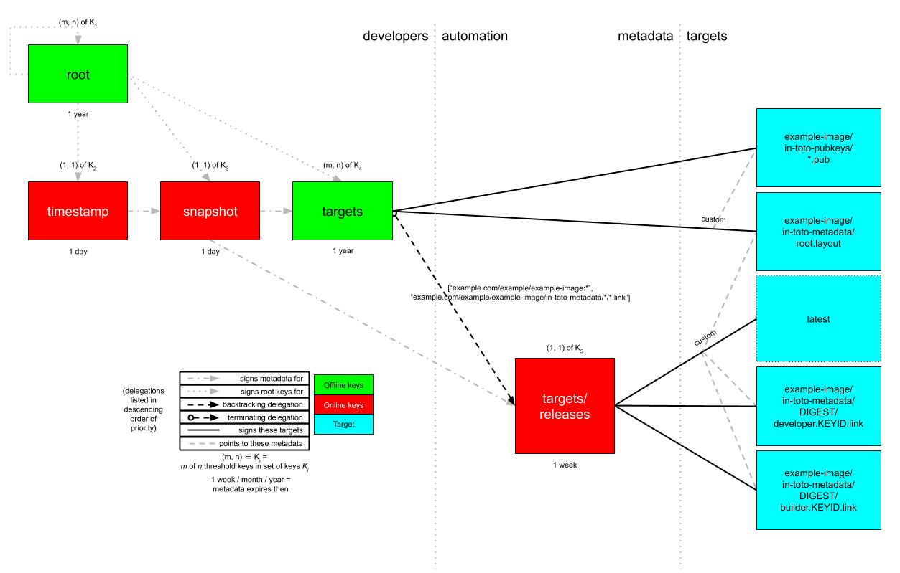

# Metadata repositories

* [Metadata repositories](#metadata-repositories)
* [Minimum viable product (MVP)](#minimum-viable-product-mvp)
  * [Security analysis of MVP](#security-analysis-of-mvp)
* [Extending the MVP to verify the provenance of bundles](#extending-the-MVP-to-verify-the-provenance-of-bundles)
  * [Security analysis of extension](#security-analysis-of-extension)

This document is a _normative_ part of [CNAB Security](300-CNAB-security.md).

The keywords MUST, MUST NOT, REQUIRED, SHALL, SHALL NOT, SHOULD, SHOULD NOT, RECOMMENDED, MAY, and OPTIONAL in this document are to be interpreted as described in [RFC 2119](https://tools.ietf.org/html/rfc2119). The use of these keywords in this document are statements about how a CNAB implementation may fulfill the CNAB Security specification _only_.

## Metadata repositories

A _metadata repository_ is a service that hosts The Update Framework (TUF) and in-toto metadata about bundles. As discussed in [300](300-CNAB-security.md), TUF adds signed metadata that provides authenticity and integrity of bundles between [CNAB registries](200-CNAB-registries.md) and users, whereas in-toto adds signed metadata that provides authenticity and integrity of bundles between developers and CNAB registries. By combining both types of signed metadata, we get end-to-end authenticity and integrity of bundles between developers and users.

Note that:
* A metadata repository MAY be physically distinct from a CNAB registry, or not (e.g., bundles as well as TUF and/or in-toto metadata MAY live as [OCI Artifacts](https://stevelasker.blog/2019/08/25/oci-artifacts-and-a-view-of-the-future/) on a CNAB registry).
* Both TUF and in-toto are frameworks that can be configured in a wide variety of ways to achieve varying degrees of security. However, we discuss one [minimum viable product (MVP)](#minimum-viable-product-mvp), which has been optimized in particular for [Docker Content Trust / Notary 0.6.1](https://github.com/theupdateframework/notary/releases/tag/v0.6.1), in this document.
* Although we discuss only the signing and verification of bundles, exactly the same principles apply to images.
* Trust for different metadata repositories with different roots of trust can be established out-of-band using an approach like [TAP 4](https://github.com/theupdateframework/taps/blob/master/tap4.md). For example, a bundle runtime could be shipped with known good copies of TUF `root` metadata for different repositories, or there could even be a meta metadata repository that distributes these `root` metadata. How to establish whether a `root` metadata file is trustworthy is out of the scope of this document.

## Minimum viable product (MVP)

This subsection discusses the simplest way that developers MAY set up a metadata repository for their bundle. Every bundle MAY use a separate metadata repository on the same server, even if two or more bundles are maintained by the same group of developers. (This is similar to how images are signed using [Docker Content Trust](https://docs.docker.com/engine/security/trust/content_trust/). As noted earlier, the MVP has been optimized for [Docker Content Trust / Notary 0.6.1](https://github.com/theupdateframework/notary/releases/tag/v0.6.1). Nevertheless, note that developers MAY use _different_ servers to host metadata repositories for bundles. In [303](303-verification-workflows.md), we discuss how a bundle runtime MAY securely resolve different bundles from different metadata repositories on different servers.) Figure 1 illustrates our simple metadata repository for a bundle.


**Figure 1**: An MVP metadata repository for a bundle.

The metadata repository for a bundle SHOULD provide at least the TUF metadata for the four top-level roles: `root`, `timestamp`, `snapshot`, and `targets`.

The `root` role distributes, revokes, and replaces the public keys for all four top-level roles. It SHOULD also use a [threshold](300-CNAB-security.md) (m, n) of [offline keys](300-CNAB-security.md), where n is the number of developers, and m is the number of quorum members that must agree on new `root` metadata. Its metadata SHOULD expire yearly, considering that an offline key ceremony is expensive in terms of time and resources.

The `timestamp` role indicates concisely whether there is any new metadata or bundle on the metadata repository.

The `snapshot` role prevents attackers from tampering with interdependencies between bundles signed by [delegations](300-CNAB-security.md), if any (none in the MVP).

Since metadata for both the `timestamp` and `snapshot` roles could be updated whenever a new version of a bundle is produced at any time, they MAY each use a threshold (1, 1) of [online keys](300-CNAB-security.md). In fact, they MAY even share the same online key. The metadata for each role MAY expire daily, since it is expected to be updated relatively frequently (e.g., whenever a developer pushes a new version of a bundle, or a scheduled job runs to renew the metadata).

The `targets` role lists the file sizes and cryptographic hashes of available versions of the bundle (e.g., `example.com/example-org/example-bundle:*`). Like the `root` role, it SHOULD also use a threshold (m, n) of offline keys, where n is the number of developers, and m is the number of quorum members that must agree on new `targets` metadata. Its metadata SHOULD expire monthly, or however often developers expect to produce new versions of the bundle.

The following code listing is an example of the `targets` metadata for a bundle:

```json
{
  "signatures": {...},
  "signed": {
    ...,
    "delegations": {},
    "targets": {
      "example.com/example-org/example-bundle:latest": {
        "hashes": {
          "sha256": "eb4189fc29d97463822ecd6409677e9a4fcb9d66d9bee392e9f9aece0917fc09"
        },
        "length": 7206
      },
    }
    ...,
  }
}
```

For operational simplicity, bundles that share the same developers MAY share `root` and `targets` keys across different metadata repositories for these bundles.

### Security analysis of MVP

With regard to key management, we assume that the `root` and `targets` keys are kept offline from the metadata repository, perhaps on private infrastructure controlled by the bundle developers. In contrast, we assume that `timestamp` and `snapshot` keys are kept online on the metadata repository.

We assume that attackers can:

1. Compromise any combination of the aforementioned keys.
1. Serve new TUF metadata as well as bundles. This can be done either with a man-in-the-middle (MitM) attack, or by compromising the metadata repository and CNAB registry.

If attackers compromise the metadata repository alone, then they have access to only the `timestamp` and `snapshot` keys. In this case, at worst, they can carry freeze and rollback attacks (limited by the expiration of `root` or `targets` metadata, whichever is earlier).

However, if attackers also compromise, say, the private infrastructure controlled by the bundle developers, then they also have access to the `targets` key. This is because the `targets` key is very likely to be kept online _within_ this private infrastructure so that developers can use CI/CD to sign new versions of bundles on demand. In this case, at worst, attackers can sign off malicious versions of bundles. Developers can use the `root` key to rotate all other keys.

Finally, if attackers somehow also compromise the `root` key, which SHOULD be kept securely on, say, a disconnected [hardware security module](https://en.wikipedia.org/wiki/Hardware_security_module) within the aforementioned private infrastructure, then attackers can not only sign off malicious versions of bundles, but also rotate all keys on the metadata repository. Nevertheless, developers can still use the `root` key to rotate all keys, including itself, for end-users who have not yet downloaded malicious versions of bundles. Other end-users will need to reset their systems, and update out-of-band.

## Extending the MVP to verify the provenance of bundles

This subsection discusses how to extend the MVP to verify the provenance of bundles. We do this by transparently including in-toto metadata using TUF as a [compromise-resilient transport protocol](https://www.datadoghq.com/blog/engineering/secure-publication-of-datadog-agent-integrations-with-tuf-and-in-toto/). Figure 2 illustrates our simple metadata repository for a bundle.


**Figure 2**: Extending the MVP metadata repository for a bundle.

Instead of signing for new versions of a bundle itself, the `targets` role here SHOULD sign targets metadata about:

1. The in-toto [root layout](300-CNAB-security.md) for this collection of bundles (e.g., `example.com/example-org/example-bundle/in-toto-metadata/root.layout`).
1. All the public keys needed to verify this root layout in the first place (e.g., `example-org/example-bundle/in-toto-pubkeys/*.pub`).

The `targets` role SHOULD delegate all versions of the bundle (e.g., `example.com/example-org/example-bundle:*`) as well as associated in-toto link metadata (e.g., `example-org/example-bundle/in-toto-metadata/*/*.link`) to the `targets/releases` role. Therefore, the `targets/releases` role SHOULD sign targets metadata about:

1. All available versions of the bundle (e.g., `example.com/example-org/example-bundle:*`).
1. All the in-toto [link metadata](300-CNAB-security.md) associated with available bundles (e.g., `example-org/example-bundle/in-toto-metadata/*/*.link`).

With regard to the last bullet point, the `targets/releases` role SHOULD include [custom targets metadata](300-CNAB-security.md) about every version of a bundle such that:

1. Each root layout lists all of the public keys needed to verify it.
1. Each bundle lists all of the root layout and link metadata required to verify this bundle.

A benefit of this approach is that different versions of bundles MAY be associated with completely different root layouts with different keys, allowing developers to update their software supply chains without breaking old bundles that are still popular.

In order to prevent conflicts between link metadata for different versions of a bundle (because link metadata filenames are of the fixed form `$KEYID.$STEP.link`, which means that link metadata for different versions of a bundle will share the same base [basenames](https://en.wikipedia.org/wiki/Basename)), the complete set of link metadata for each bundle MAY be isolated in different directories. The simplest way to do this is to use a separate directory to contain the in-toto link metadata for each bundle that is named after the digest (e.g., SHA-256) for that bundle.

The following code listing is an example of the `targets` metadata for a bundle:

```json
{
  "signatures": {...},
  "signed": {
    ...,
    "delegations": {
      "keys": {...},
      "roles": [
        {
          "keyids": [...],
          "name": "targets/releases",
          "paths": [
            "example.com/example/example-image:*",
            "example.com/example/example-image/in-toto-metadata/*/*.link"
          ],
          "threshold": 1
        }
      ]
    },
    "targets": {
      "example.com/example-org/example-bundle/in-toto-metadata/root.layout": {
        "custom": {
          "in-toto": [
            "example.com/example-org/example-bundle/in-toto-pubkeys/298f37401f0b526a708967b7f708bc9c938fe0ad4bfe50d66837c20a57084e84.pub",
            "example.com/example-org/example-bundle/in-toto-pubkeys/3e82bcdc71b29999340ceaadf3dc4193f8b06572d1c20612e9acdd7b52fa4b90.pub",
            "example.com/example-org/example-bundle/in-toto-pubkeys/e847f58ca5e83fc48d1d2388ddd8f1a168b205a3fe7978ad015dee3ae7b2ecf7.pub"
          ]
        },
        "hashes": {
          "sha256": "930c48fa182d14835febd6a7f9129e34b83246f74238b9747fef7fc12147184d"
        },
        "length": 101047
      },
      "example.com/example-org/example-bundle/in-toto-pubkeys/298f37401f0b526a708967b7f708bc9c938fe0ad4bfe50d66837c20a57084e84.pub": {
        "hashes": {
          "sha256": "a19b11a130b35fb205e8cf8ab2f2488f387332be56857968785ce9899a521b05"
        },
        "length": 799
      },
      "example.com/example-org/example-bundle/in-toto-pubkeys/3e82bcdc71b29999340ceaadf3dc4193f8b06572d1c20612e9acdd7b52fa4b90.pub": {
        "hashes": {
          "sha256": "3560de9da223ac51b5cdbf25acf9f8e8f9f7b699eeda912c7a26a68c5f01ce12"
        },
        "length": 799
      },
      "example.com/example-org/example-bundle/in-toto-pubkeys/e847f58ca5e83fc48d1d2388ddd8f1a168b205a3fe7978ad015dee3ae7b2ecf7.pub": {
        "hashes": {
          "sha256": "8cb4a254ae123a8bd91b1c9abdd99e719aa8349ff7eafd168988ce8a935d51a1"
        },
        "length": 799
      }
    }
    ...,
  }
}
```


The following code listing is an example of the `targets/releases` metadata for a bundle:

```json
{
  "signatures": {...},
  "signed": {
    ...,
    "delegations": {},
    "targets": {
      "example.com/example-org/example-bundle:latest": {
        "custom": {
          "in-toto": [
            "example.com/example-org/example-bundle/in-toto-metadata/root.layout",
            "example.com/example-org/example-image/in-toto-metadata/eb4189fc29d97463822ecd6409677e9a4fcb9d66d9bee392e9f9aece0917fc09/step1.87d52666.link",
            "example.com/example-org/example-image/in-toto-metadata/eb4189fc29d97463822ecd6409677e9a4fcb9d66d9bee392e9f9aece0917fc09/step2.20585de1.link"
          ]
        },
        "hashes": {
          "sha256": "eb4189fc29d97463822ecd6409677e9a4fcb9d66d9bee392e9f9aece0917fc09"
        },
        "length": 7206
      },
      "example.com/example-org/example-image/in-toto-metadata/eb4189fc29d97463822ecd6409677e9a4fcb9d66d9bee392e9f9aece0917fc09/step1.87d52666.link": {
        "hashes": {
          "sha256": "0a33cbf67b70f315c0b7a83923bcef35308e986140169950e609e3be38585289"
        },
        "length": 132251
      },
      "example.com/example-org/example-image/in-toto-metadata/eb4189fc29d97463822ecd6409677e9a4fcb9d66d9bee392e9f9aece0917fc09/step2.20585de1.link": {
        "hashes": {
          "sha256": "e5076f59e2096fb64deae6b13384575d3d63c1c4f7a42f48d0a238097a8823eb"
        },
        "length": 57495
      }
    }
    ...,
  }
}
```

### Security analysis of extension

The biggest difference between this extension and the MVP itself is that there is now compromise-resilient distribution of the software supply chain for the bundle using the in-toto root layout. In addition to the assurances of the MVP, this provides additional assurance that attackers cannot change the rules of the software supply chain governing how this bundle was produced.

Assuming that the `targets/releases` key is kept on private infrastructure controlled by the bundle developers, and even if attackers compromise this key, then they cannot change the rules governing the software supply chain.

However, we _cannot_ analyze the security provided by the software supply chain itself. This is because different bundles are very likely to have different software supply chains. For example, if all the keys used to sign all the steps (and therefore in-toto link metadata) in the software supply chain are kept online on the aforementioned private infrastructure, then this is _not_ as secure a setup as the case where source code must be signed off by developers using keys protected using hardware security keys.  Known [implementations](304-known-implementations.md) SHOULD provide usable software supply chains out of the box that provide sufficiently strong security guarantees without hampering usability by developers.

For an example of how to design a secure software supply chain, please see the following [example](https://www.datadoghq.com/blog/engineering/secure-publication-of-datadog-agent-integrations-with-tuf-and-in-toto/).