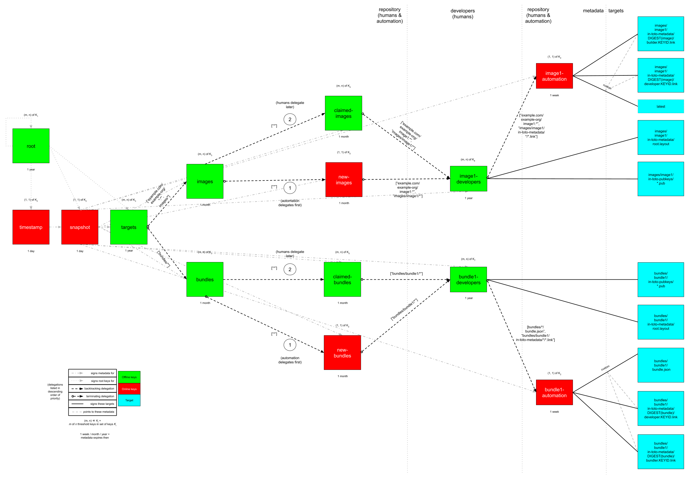

# Cloud Native Application Bundles Security (CNAB-Sec): Metadata repositories 1.0 WD

* [Metadata repositories](#metadata-repositories)
  * [Minimum viable product (MVP)](#minimum-viable-product-mvp)
    * [Security analysis](#security-analysis)
* [References](#references)

This document is a _normative_ part of [CNAB Security](300-CNAB-security.md).

The keywords MUST, MUST NOT, REQUIRED, SHALL, SHALL NOT, SHOULD, SHOULD NOT, RECOMMENDED, MAY, and OPTIONAL in this document are to be interpreted as described in [RFC 2119](https://tools.ietf.org/html/rfc2119). The use of these keywords in this document are statements about how a CNAB implementation may fulfill the CNAB Security specification _only_.

## Metadata repositories

A _metadata repository_ is a service that hosts The Update Framework (TUF) and in-toto metadata about bundles. As discussed in [300](300-CNAB-security.md), TUF adds signed metadata that provides authenticity and integrity of bundles between [CNAB registries](200-CNAB-registries.md) and users, whereas in-toto adds signed metadata that provides authenticity and integrity of bundles between developers and CNAB registries. By combining both types of signed metadata, we get end-to-end authenticity and integrity of bundles between developers and users.

Note that:
* A metadata repository MAY be physically distinct from a CNAB registry, or not (e.g., bundles as well as TUF and/or in-toto metadata MAY live as [OCI Artifacts](https://stevelasker.blog/2019/08/25/oci-artifacts-and-a-view-of-the-future/) on a CNAB registry).
* Both TUF and in-toto are frameworks that can be configured in a wide variety of ways to achieve varying degrees of security. However, we discuss one [minimum viable product (MVP)](#minimum-viable-product-mvp) in this document.
* Although we discuss only the signing and verification of bundles, exactly the same principles apply to images.


### Minimum viable product (MVP)

This subsection discusses how an organization (e.g., `example.com/example-org/*`) MAY setup a metadata repository that hosts metadata about bundles developed and/or maintained by different _projects_, groups of developers.



Figure 1 illustrates this suggested metadata repository, which we discuss using a top-down, outside-in approach.

The four-top level TUF `root`, `timestamp`, `snapshot`, and `targets` roles SHOULD be controlled by the repository _administrators_, who develop and maintain the repository's hardware and software.

The `root` role distributes, revokes, and replaces the public keys for all four top-level roles. It SHOULD use _offline keys_, or signing keys kept off the Internet (e.g., on trusted hardware in cold storage). It SHOULD also use a threshold (m, n) of keys, where n is the number of administrators, and m is the number of quorum members that must agree on new `root` metadata. Its metadata SHOULD expire yearly, considering that an offline key ceremony is expensive in terms of time and resources.

The `timestamp` role indicates concisely whether there is any new metadata or bundle on the repository.

The `snapshot` role prevents attackers from tampering with interdependencies between bundles.

Since metadata for both the `timestamp` and `snapshot` roles could be updated whenever a new bundle is produced at any time, they MAY each use a threshold (1, 1) of _online keys_, or signing keys accessible on-demand by automation for the repository. In fact, they MAY even share the same online key. The metadata for each role MAY expire daily, since it is expected to be updated relatively frequently (e.g., whenever a developer pushes a new bundle, or a scheduled job runs to renew the metadata).

In order to achieve [gradual security](300-cnab-security.md#gradual-security) over time, it is RECOMMENDED to use the delegation model described in the rest of this subsection. Following the SHOULD recommendations, if bundles are first signed using only TUF, then level 1a or 1b security is provided respectively. If both are signed using TUF, then level 2 security is provided. Building on top of that, following the MAY recommendations, if bundles are additionally signed using in-toto, then level 3a or 3b security is provided. Finally, if both are signed using TUF and in-toto, then level 4 security is provided.


The following code listing is an example of this `targets` metadata:

```json
{
  "signatures": {...},
  "signed": {
    ...,
    "delegations": {},
    "targets": {
      "bundles/bundle1/in-toto-metadata/root.layout": {
        "hashes": {
          "sha256": "930c48fa182d14835febd6a7f9129e34b83246f74238b9747fef7fc12147184d",
          "sha512": "6fb781b534266411d0c424626b728b57e6c0a39b21798729efc63ff73556dfd19ebeddf7612da272936dad890d71b7e3caa65735ab6ac293740f2c5d29795590"
        },
        "length": 101047
      },
      "bundles/bundle1/in-toto-pubkeys/298f37401f0b526a708967b7f708bc9c938fe0ad4bfe50d66837c20a57084e84.pub": {
        "hashes": {
          "sha256": "a19b11a130b35fb205e8cf8ab2f2488f387332be56857968785ce9899a521b05",
          "sha512": "b7e48526cdde5c879e710c9542b4cc6b36de91ed93d709d2f5be4ec45d719e77397f69b6b8c117826987418d334eb01e9d27b37874c66157b536a77035b44048"
        },
        "length": 799
      },
      "bundles/bundle1/in-toto-pubkeys/3e82bcdc71b29999340ceaadf3dc4193f8b06572d1c20612e9acdd7b52fa4b90.pub": {
        "hashes": {
          "sha256": "3560de9da223ac51b5cdbf25acf9f8e8f9f7b699eeda912c7a26a68c5f01ce12",
          "sha512": "65aa1c2e7114714224142812bfc7bb8b2e6a37f54ebdbcbe20cc6e8f1504d73df17747a3ccc5acbdbefbe4df58065f88c72e4c4dac7e50c067c05b8b2ee25f4f"
        },
        "length": 799
      },
      "bundles/bundle1/in-toto-pubkeys/e847f58ca5e83fc48d1d2388ddd8f1a168b205a3fe7978ad015dee3ae7b2ecf7.pub": {
        "hashes": {
          "sha256": "8cb4a254ae123a8bd91b1c9abdd99e719aa8349ff7eafd168988ce8a935d51a1",
          "sha512": "e259f98b766537ed2893c1b1e25d171d8ab374702f29d0fbe3708b13a4456e153b29e36722f136bc963e4a85fa7581dfbbf40ebd3e1538227ec30874264ddd2b"
        },
        "length": 799
      },
      "example.com/example-org/bundle1:latest": {
        "custom": {
          "in-toto": [
            "example-image/in-toto-metadata/eb4189fc29d97463822ecd6409677e9a4fcb9d66d9bee392e9f9aece0917fc09/developer.87d52666.link",
            "example-image/in-toto-metadata/eb4189fc29d97463822ecd6409677e9a4fcb9d66d9bee392e9f9aece0917fc09/builder.20585de1.link"
          ]
        },
        "hashes": {
          "sha256": "eb4189fc29d97463822ecd6409677e9a4fcb9d66d9bee392e9f9aece0917fc09",
          "sha512": "059358c3ecfd97af4b392c384a44d2349d7d5e6f1a78736d891a6eb105a088fff64571fe21c998dfbad113bfcb4ab6ff65a35259fd24fa958f8b17151ff4aefb"
        },
        "length": 7206
      },
      "example-image/in-toto-metadata/eb4189fc29d97463822ecd6409677e9a4fcb9d66d9bee392e9f9aece0917fc09/step1.87d52666.link": {
        "hashes": {
          "sha256": "0a33cbf67b70f315c0b7a83923bcef35308e986140169950e609e3be38585289",
          "sha512": "848188de9c1ec1d855ed88d62114f0d4f0f13df6fb5aae77716276a1240cefbe7cf03c1b664e43dc93c3438c82e88f3d910ab3d10d55bfc31a759b7997c4b6cb"
        },
        "length": 132251
      },
      "example-image/in-toto-metadata/eb4189fc29d97463822ecd6409677e9a4fcb9d66d9bee392e9f9aece0917fc09/step2.20585de1.link": {
        "hashes": {
          "sha256": "e5076f59e2096fb64deae6b13384575d3d63c1c4f7a42f48d0a238097a8823eb",
          "sha512": "7f8c1496abca669c3e8cdbfd315e2383bb4fc3386d06258d961a5fe059b2ea9afa410f9924462933ec3c6570f2c3744f13882f61394687bf9de1156e7c6c2357"
        },
        "length": 57495
      }
    }
    ...,
  }
}
```

Regardless of whether the `claimed-bundles` or `new-bundles` role has delegated a bundle (e.g., `["example.com/example-org/bundle1:*", "bundles/bundle1/*"]`) to its developers, the developers (e.g., `bundle1-developers`) MAY not sign the bundle themselves, because this would prove to be too burdensome to do whenever a new version of the bundle is produced, especially at a high enough frequency. Instead, they MAY delegate all versions of the bundle (e.g. `example.com/example-org/bundle1:*`) to CI/CD automation (e.g., `bundle1-automation`).

If end-to-end authenticity and integrity of the bundle is desired, the developers MAY also sign targets metadata about the in-toto root layout for this bundle, as well as the public keys used to verify this root layout. The developers MAY also delegate the signing of in-toto link metadata  about the bundle (e.g., `bundles/bundle1/in-toto-metadata/*/*.link`) to the automation.

The developers SHOULD  use a threshold (m, n) of offline keys, where n is the number of developers, and m is at least 1. Their metadata SHOULD expire yearly, assuming that developers join and leave relatively rarely.

If end-to-end authenticity and integrity of bundles is desired, each version (e.g., `latest`) of the bundle MAY include custom targets metadata that refers to a complete set of in-toto link metadata (a.k.a. _links_) required to verify that bundle according to the root layout specified by its developers (e.g., `bundle1-developers`). In this case, the automation MAY also sign targets metadata about all links for all available versions of the bundle.

For each bundle, there MAY be as many links as there are steps in the root layout. The exact setup of the root layout depends on the organization and the specific group of developers, and hence out of the scope of this document. However, as a working example, suppose that there are two steps in the root layout:

1. In the `developer` step, developers MAY sign link metadata about all code and data required to build a bundle. They MAY use offline keys (e.g. [YubiKeys](https://github.com/DataDog/yubikey)) to sign this link. Finally, they MAY also check all of this code and data into a version control system (VCS).
2. In the `builder` step, the CI/CD automation MAY sign link metadata about all of the code and data it received from this VCS about this bundle. It MAY also sign link metadata about the bundle it built using this code and data. (As part of [reproducible builds](https://reproducible-builds.org), which is out of the scope of this document, the root layout MAY require two different builders to agree on the same digest for the same bundle.) The automation MAY use online keys to sign this link. In fact, it MAY even share the same online key with the `timestamp` and `snapshot` roles.

In order to prevent conflicts between links for different versions of a bundle, the complete set of link metadata for each bundle MAY be isolated in different directories. The simplest way to do this is to use a separate directory for each bundle that is named after the digest (e.g., SHA-256) for that bundle.

Returning to the TUF targets metadata for the automation, it SHOULD use a threshold (1, 1) of online keys. In fact, it MAY even share the same online key with the `timestamp` and `snapshot` roles. Its metadata SHOULD expire weekly, assuming that new bundles are produced a few times a week.

As discussed in the previous subsections, metadata delineated in red (denoting online keys) in Figure 1 MAY and SHOULD be signed using a threshold (1, 1) of _online keys. This includes, for example, the `snapshot` and `timestamp` metadata. These online keys MAY be kept directly accessible by the metadata repository.

#### Security analysis

> **TODO**: Assuming that the delegations are correctly prioritized and terminating, the security analysis for this metadata repository should be similar to those in [7, 9].

## References

1. [The TUF specification](https://github.com/theupdateframework/specification)
2. [The in-toto specification](https://github.com/in-toto/docs)
3. [ITE-2: A general overview of combining TUF and in-toto to build compromise-resilient CI/CD
](https://github.com/in-toto/ITE/pull/4)
4. [Secure Publication of Datadog Agent Integrations with TUF and in-toto](https://www.datadoghq.com/blog/engineering/secure-publication-of-datadog-agent-integrations-with-tuf-and-in-toto/)
5. [ITE-3: Real-world example of combining TUF and in-toto for packaging Datadog Agent integrations
](https://github.com/in-toto/ITE/pull/5)
6. [PEP 458 -- Surviving a Compromise of PyPI](https://www.python.org/dev/peps/pep-0458/)
7. [PEP 480 -- Surviving a Compromise of PyPI: The Maximum Security Model](https://www.python.org/dev/peps/pep-0480/)
8. [Survivable Key Compromise in Software Update Systems](https://ssl.engineering.nyu.edu/papers/samuel_tuf_ccs_2010.pdf)
9. [Diplomat: Using Delegations to Protect Community Repositories](https://www.usenix.org/node/194973)
10. [Mercury: Bandwidth-Effective Prevention of Rollback Attacks Against Community Repositories](https://www.usenix.org/conference/atc17/technical-sessions/presentation/kuppusamy)